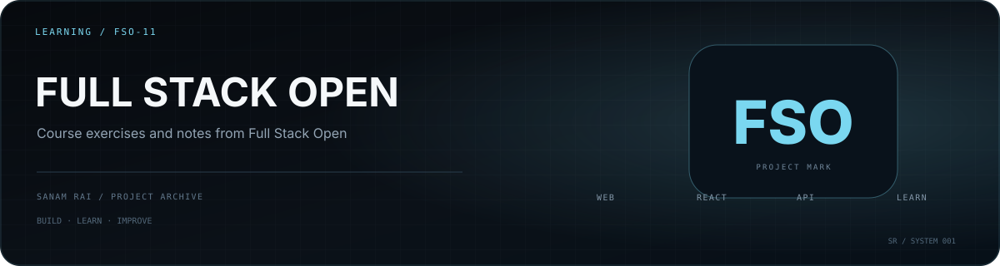

  

# Full Stack Open — Sanam

My exercise repository for **Full Stack Open**, used to track course work and practice while learning modern web-development concepts.

The repository currently begins with `part0/` and is kept as a learning record rather than a standalone product.

## Purpose

- keep course exercises organized
- preserve examples I worked through
- make progress visible over time
- give myself a reference for concepts I learned earlier

## Status

**Learning repository / course work.**

---

**Sanam Rai** · [GitHub profile](https://github.com/SanamRai001)
