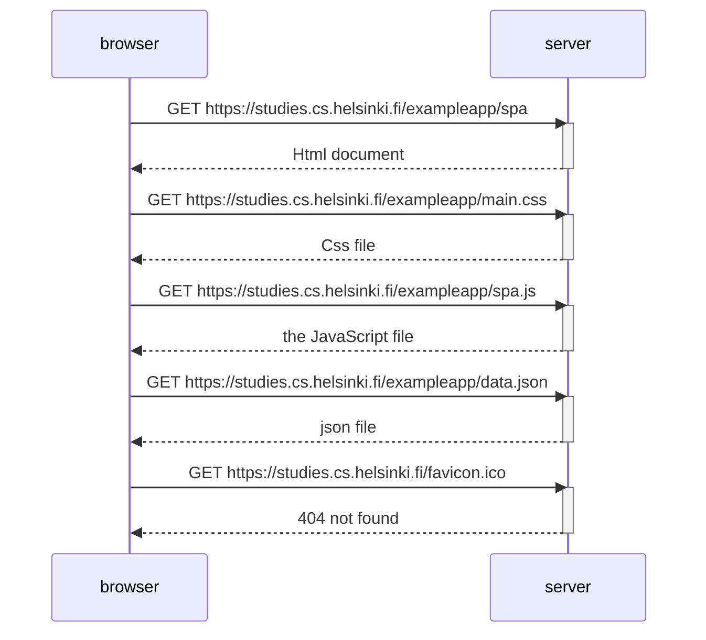

```mermaid
sequenceDiagram
    participant browser
    participant server

    browser->>server: 	GET https://studies.cs.helsinki.fi/exampleapp/spa
    activate server
    server-->>browser: Html document
    deactivate server

    browser->>server: 	GET https://studies.cs.helsinki.fi/exampleapp/main.css
    activate server
    server-->>browser: Css file
    deactivate server

    browser->>server: 	GET https://studies.cs.helsinki.fi/exampleapp/spa.js
    activate server
    server-->>browser: the JavaScript file
    deactivate server

    browser->>server: 	GET https://studies.cs.helsinki.fi/exampleapp/data.json
    activate server
    server-->>browser: json file
    deactivate server

    browser->>server: 	GET https://studies.cs.helsinki.fi/favicon.ico
    activate server
    server-->>browser: 404 not found
    deactivate server


```
